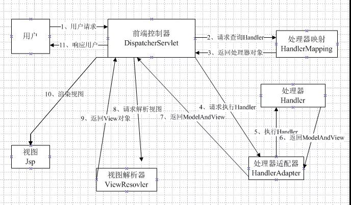
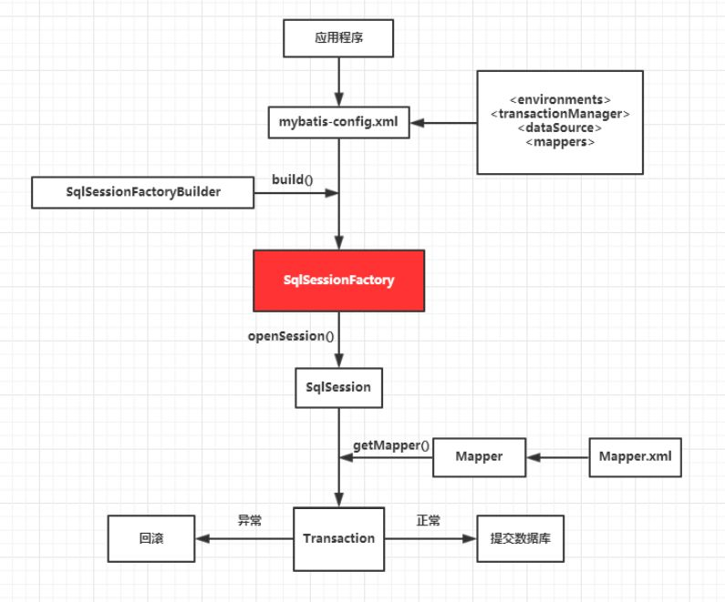

1、Spring 在ssm中起什么作用？
```
Spring：轻量级框架
作用：Bean工厂，用来管理Bean的生命周期和框架集成。
两大核心：
    1、IOC/DI(控制反转/依赖注入) ：把dao依赖注入到service层，service层反转给action层，Spring顶层容器为BeanFactory。
    2、AOP：面向切面编程
```

2、Spring主要使用了什么模式？
```
工厂模式：每个Bean的创建通过方法
单例模式：默认的每个Bean的作用域都是单例
代理模式：关于Aop的实现通过代理模式
```

3、SpringMvc的工作流程图?      


4、Mybatis的好处？
````
把Sql语句从Java中独立出来。
封装了底层的JDBC，API的调用，并且能够将结果集自动转换成JavaBean对象，简化了Java数据库编程的重复工作。
自己编写Sql语句，更加的灵活。
入参无需用对象封装（或者map封装）,使用@Param注解
````

5、、Mybatis配置中${} 和 #{}的区别？
```
${}：简单字符串替换，把${}直接替换成变量的值，不做任何转换，这种是取值以后再去编译SQL语句。
#{}：预编译处理，sql中的#{}替换成？，补全预编译语句，有效的防止Sql语句注入，这种取值是编译好SQL语句再取值。
总结：一般用#{}来进行列的代替
```

6、获取上一次自动生成的主键值？
```
select last  _insert_id()
```

7、Mybatis工作原理？      

```
通过SqlSessionFactoryBuilder从mybatis-config.xml配置文件中构建出SqlSessionFactory。
SqlSessionFactory开启一个SqlSession，通过SqlSession实例获得Mapper对象并且运行Mapper映射的Sql语句。
完成数据库的CRUD操作和事务提交，关闭SqlSession。
```