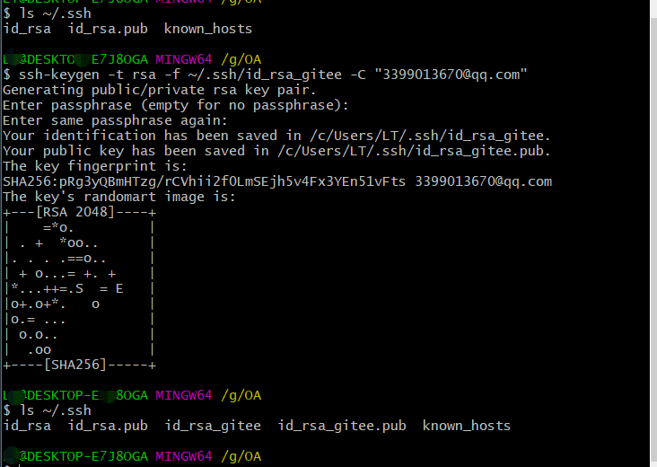

##### 亲测本地电脑同时配置gitee和github账号,实现ssh免密拉取和提交代码配置？

**问题**                
本地已配置了githup ssh，如何配置gitee支持ssh拉取源码？

**思路**      
ssh 方式链接到 Github／GitLab，需要唯一的公钥，如果想同一台电脑绑定两个Github/GitLab 帐号，需要两个条件:        
1.能够生成两对 私钥/公钥     
2.push 时，可以区分两个账户，推送到相应的仓库     

**解决方案**        
1.生成 私钥/公钥 时，密钥文件命名避免重复        
2.设置不同 Host 对应同一 HostName 但密钥不同        
3.取消 git 全局用户名/邮箱设置，为每个仓库独立设置 用户名/邮箱       


**解决步骤**         
1.查看已有githup配置
```
ls ~/.ssh
```
      
2.生成新公钥
```
ssh-keygen -t rsa -f ~/.ssh/id_rsa_gitee -C "your email@xx.com"
```   


3.复制id_rsa_gitee.pub的公钥到远程ssh配置处（省略）        
4.配置config文件。在 .ssh 文件夹下新建 **config**文件并编辑，使不同 Host 实际映射到同一HostName，但密钥文件不同。
```
# default                                                                       
Host github.com
HostName github.com
User songyp
IdentityFile ~/.ssh/id_rsa
# two                                                                           
Host gitee.com
HostName gitee.com
User git
IdentityFile ~/.ssh/id_rsa_gitee
```
5.测试 ssh 链接    
```
ssh -T git@gitlab.com
ssh -T git@github.com
# Hi XXX! You've successfully authenticated, but GitHub does not provide shell access.
# 出现上边这句，表示链接成功
``` 
![result](images/03_test.png

6.取消全局 用户名/邮箱设置，并进入项目文件夹单独设置。git config命令要到工程目录下执行。
电脑平时使用githup比较多，可以把githup的账户设置为全局，然后在单独的需要用别的账号的工程下配置对应的账号。
这样就不用频繁地做这个配置。
```
# 取消全局 用户名/邮箱 配置
git config –global –unset user.name
git config –global –unset user.email
# 单独设置每个repo 用户名/邮箱
git config user.email “xxxx@xx.com”
git config user.name “xxxx”
```